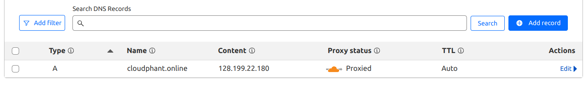
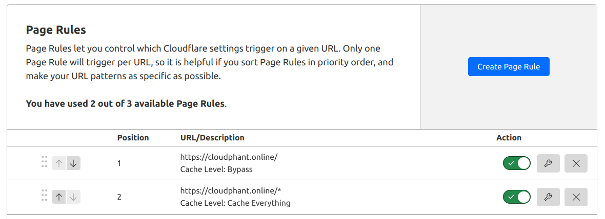

# Zero Plugin Setup

> Provided by: [cloudphant.com](https://cloudphant.com).
> These are sample codes used by us in multiple places but you can change these as per your requirement.

---

- HTML Minify (mu-plugins)
```
<?php
// Hook into WordPress to minify HTML output
add_action('template_redirect', 'html_minify_output');

function html_minify_output() {
    // Start output buffering
    ob_start('minify_html');

    // Hook into 'shutdown' action to send the minified output to the browser
    add_action('shutdown', function() {
        ob_end_flush();
    }, 0);
}

function minify_html($buffer) {
    // Remove HTML comments
    $buffer = preg_replace('/<!--[\s\S]*?-->/', '', $buffer);

    // Minify HTML output
    $search = [
        '/\>[^\S ]+/s',  // Strip whitespaces after tags, except space
        '/[^\S ]+\</s',  // Strip whitespaces before tags, except space
        '/(\s)+/s'       // Shorten multiple whitespace sequences
    ];

    $replace = [
        '>',
        '<',
        '\\1'
    ];

    $buffer = preg_replace($search, $replace, $buffer);

    return $buffer;
}
```

- JS Minify (mu-plugins)
```
<?php
// Minify and cache JS
add_action('wp_enqueue_scripts', 'custom_minify_and_cache_js', 20);
function custom_minify_and_cache_js() {
    $scripts = wp_scripts();

    foreach ($scripts->queue as $handle) {
        $src = $scripts->registered[$handle]->src;

        // Skip external JS files
        if (strpos($src, home_url()) !== 0) {
            continue;
        }

        // Skip already minified JS files
        if (strpos($src, '.min.js') !== false) {
            continue;
        }

        // Convert URL to file path
        $relative_path = wp_make_link_relative($src);
        $js_file_path = wp_normalize_path(ABSPATH . ltrim($relative_path, '/'));

        if (file_exists($js_file_path)) {
            // Generate the path for the minified version
            $minified_js_path = custom_get_minified_js_path($js_file_path);

            // If minified file doesn't exist, create it
            if (!file_exists($minified_js_path)) {
                $js_content = file_get_contents($js_file_path);
                $minified_content = custom_minify_js_content($js_content);
                file_put_contents($minified_js_path, $minified_content);
            }

            // Use the minified JS file
            $minified_js_url = content_url('uploads/cp-minify/js/' . basename($minified_js_path));
            
            // Replace the original JS with the minified version
            wp_deregister_script($handle);
            wp_register_script($handle, $minified_js_url, [], filemtime($minified_js_path), true);
            wp_enqueue_script($handle);
        }
    }
}

// Get the path for the minified JS file
function custom_get_minified_js_path($js_file_path) {
    $upload_dir = wp_upload_dir();
    return wp_normalize_path($upload_dir['basedir'] . '/cp-minify/js/' . basename($js_file_path, '.js') . '.min.js');
}

// Minify JS content
function custom_minify_js_content($js_content) {
    // Minification logic: remove comments and whitespace
    $js_content = preg_replace('/\/\/.*?$|\/\*.*?\*\/|(?<!\S)\/\/.*?\n/s', '', $js_content); // Remove comments
    $js_content = preg_replace('/\s+/', ' ', $js_content); // Remove excess whitespace
    $js_content = str_replace([' ;', ' ,', ' {', '} '], [';', ',', '{', '}'], $js_content); // Optimize spaces
    return trim($js_content);
}
```

- CSS Minify (mu-plugins)
```
<?php
// Minify and cache CSS
add_action('wp_enqueue_scripts', 'custom_minify_and_cache_css', 20);
function custom_minify_and_cache_css()
{
    $styles = wp_styles();

    foreach ($styles->queue as $handle) {
        $src = $styles->registered[$handle]->src;

        // Skip external CSS files
        if (strpos($src, home_url()) !== 0) {
            continue;
        }

        // Skip already minified CSS files
        if (strpos($src, '.min.css') !== false) {
            continue;
        }

        // Convert URL to file path
        $relative_path = wp_make_link_relative($src);
        $css_file_path = wp_normalize_path(ABSPATH . ltrim($relative_path, '/'));

        if (file_exists($css_file_path)) {
            // Generate the path for the minified version
            $minified_css_path = custom_get_minified_path($css_file_path);

            // If minified file doesn't exist, create it
            if (!file_exists($minified_css_path)) {
                $css_content = file_get_contents($css_file_path);
                $minified_content = custom_minify_css_content($css_content);
                file_put_contents($minified_css_path, $minified_content);
            }

            // Use the minified CSS file
            $minified_css_url = content_url('uploads/cp-minify/css/' . basename($minified_css_path));

            // Replace the original CSS with the minified version
            wp_deregister_style($handle);
            wp_register_style($handle, $minified_css_url, [], filemtime($minified_css_path));
            wp_enqueue_style($handle);
        }
    }
}

// Get the path for the minified CSS file
function custom_get_minified_path($css_file_path)
{
    $upload_dir = wp_upload_dir();
    return wp_normalize_path($upload_dir['basedir'] . '/cp-minify/css/' . basename($css_file_path, '.css') . '.min.css');
}

// Minify CSS content
function custom_minify_css_content($css_content)
{
    // Minification logic: remove comments and whitespace
    $css_content = preg_replace('!/\*.*?\*/!s', '', $css_content); // Remove comments
    $css_content = preg_replace('/\s+/', ' ', $css_content); // Remove excess whitespace
    $css_content = str_replace([' :', ' {', '; ', ', ', '} '], [':', '{', ';', ',', '}'], $css_content); // Optimize spaces
    return trim($css_content);
}
```

- JS Defer (mu-plugins)
```
<?php
// Add 'defer' attribute to all enqueued scripts
add_filter('script_loader_tag', 'add_defer_attribute_to_scripts', 10, 2);
function add_defer_attribute_to_scripts($tag, $handle) {
    // Skip if 'src' attribute is missing, 'defer' is already present, or if the script is admin-related
    if (strpos($tag, 'src=') === false || strpos($tag, 'defer') !== false || is_admin()) {
        return $tag;
    }

    // Add 'defer' attribute
    $tag = str_replace('<script ', '<script defer ', $tag);
    return $tag;
}
```

- WebP Conversion & Delivery (mu-plugins + Nginx configuration)

WebP mu-plugin code used in webinar was tightly coupled with the Cloudphant's platform so I'll not paste it here as it'll not work for general use cases. You can use chatgpt to create your own plugin code. I'll mention the points to keep in mind though:

1. WebP creation on `wp_generate_attachment_metadata` hook trigger.
2. You can use `gd` or `imagick` to convert images.
3. Convert all created thumbnails as well: `$thumbnail_sizes = array_merge(array('full'), get_intermediate_image_sizes());`
4. Add deletion of all images including thumbnails on `delete_attachment` hook trigger.

Nginx configuration:
```
location ~ /wp-content/uploads/(?<path>.+)\.(?<ext>jpe?g|png)$ {
    add_header Vary Accept;
    expires 365d;
    try_files /wp-content/uploads/$path.$ext.webp $uri =404;
}
```

- Browser Cache (Nginx configuration)
```
location ~* \.(ogg|ogv|svg|svgz|eot|otf|woff|mp4|ttf|css|rss|atom|js|jpg|jpeg|gif|png|ico|zip|tgz|gz|rar|bz2|doc|xls|exe|ppt|tar|mid|midi|wav|bmp|rtf)$ {
    expires 1M;
    access_log off;
    add_header Cache-Control "public";
}
```

- Object Cache (drop-in)

In webinar I used drop-in from here which is working fine for me without any issues: https://github.com/rhubarbgroup/redis-cache/blob/develop/includes/object-cache.php

But I'd suggest you to use chatgpt to create your own drop-in as per your use case.

- Page Cache (Nginx configuration)
> Detailed info: https://www.linode.com/docs/guides/how-to-use-nginx-fastcgi-page-cache-with-wordpress/
```
fastcgi_cache_path /etc/nginx/cache levels=1:2 keys_zone=wpcache:200m max_size=10g inactive=2h use_temp_path=off;
fastcgi_cache_key "$scheme$request_method$host$request_uri";
fastcgi_ignore_headers Cache-Control Expires Set-Cookie;

server {
    listen 80;
    listen [::]:80;

    server_name example.com www.example.com;
    root /var/www/html/example.com/public_html;
    index index.html;

    set $skip_cache 0;

    if ($request_method = POST) {
        set $skip_cache 1;
    }
    if ($query_string != "") {
        set $skip_cache 1;
    }

    if ($request_uri ~* "/wp-admin/|/xmlrpc.php|wp-.*.php|^/feed/*|/tag/.*/feed/*|index.php|/.*sitemap.*\.(xml|xsl)") {
        set $skip_cache 1;
    }

    if ($http_cookie ~* "comment_author|wordpress_[a-f0-9]+|wp-postpass|wordpress_no_cache|wordpress_logged_in") {
        set $skip_cache 1;
    }

    location / {
        index index.php index.html index.htm;
        try_files $uri $uri/ =404;
    }

    location ~ \.php$ {
        fastcgi_pass unix:/var/run/php/php8.1-fpm.sock;
        include snippets/fastcgi-php.conf;

        fastcgi_cache wpcache;
        fastcgi_cache_valid 200 301 302 2h;
        fastcgi_cache_use_stale error timeout updating invalid_header http_500 http_503;
        fastcgi_cache_min_uses 1;
        fastcgi_cache_lock on;
        fastcgi_cache_bypass $skip_cache;
        fastcgi_no_cache $skip_cache;
        add_header X-FastCGI-Cache $upstream_cache_status;
    }
}
```

- Static Resources (CSS, JS, Font, Image) CDN

We simply used Cloudflare and proxied our website through it. It's free and fast and not further setup is required to start using their CDN.



- Edge Cache (Cloudflare page rules)

We again used Cloudflare's page cache rules to enable static page CDN.



- Database Cleanup (Queries)

You can run these queries in phpmyadmin or simply setup a cron to run these regularly.

1. `DELETE_DRAFTS: DELETE FROM {{WP_PREFIX}}posts WHERE post_status = 'draft'`
  
2. `DELETE_REVISIONS: DELETE FROM {{WP_PREFIX}}posts WHERE post_type = 'revision'`

3. `DELETE_TRASHED_POSTS: DELETE FROM {{WP_PREFIX}}posts WHERE post_status = 'trash'`

4. `DELETE_SPAM_COMMENTS: DELETE FROM {{WP_PREFIX}}comments WHERE comment_approved = 'spam'`

5. `DELETE_UNAPPROVED_COMMENTS: DELETE from {{WP_PREFIX}}comments WHERE comment_approved = '0'`

6. `DELETE_TRANSIENTS: DELETE FROM {{WP_PREFIX}}options WHERE option_name LIKE ('%_transient_%')`

7. `DELETE_PINGBACKS: DELETE FROM {{WP_PREFIX}}comments WHERE comment_type = 'pingback'`

8. `DELETE_ORPHANED_POSTS_META: DELETE m FROM {{WP_PREFIX}}postmeta AS m LEFT JOIN {{WP_PREFIX}}posts AS p ON m.post_id = p.ID WHERE p.ID IS NULL`

> Plugins Replaced: Optimization Plugins (Autooptimize, Litespeed), WebP Converters, Database Cleaner, Object Cache Plugins, Malware Scanners, Firewall Plugins, Admin Login security plugins


&copy; [cloudphant.com](https://cloudphant.com)